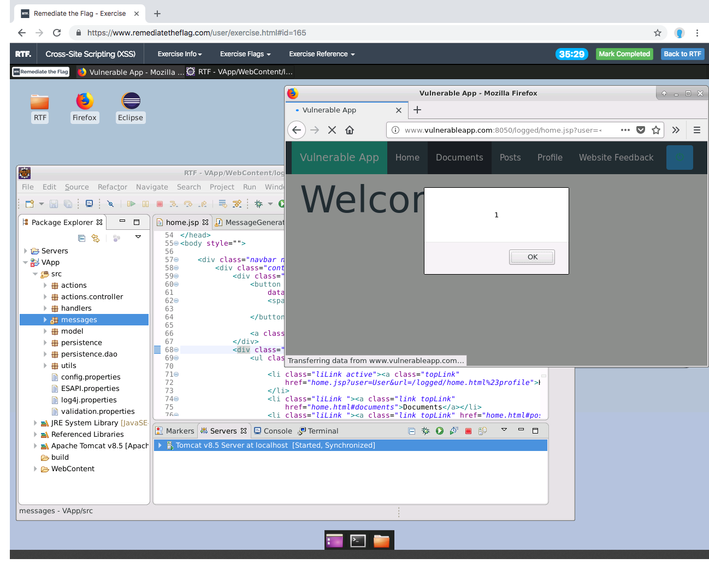

# Remediate the Flag

    + [(Practical) Application Security Training Platform](#user-content-practical-application-security-training-platform)
    + [Functionalities](#user-content-functionalities)
    + [How Does it Work?](#user-content-how-does-it-work-)
    + [Architecture](#user-content-architecture)
    + [Platform Installation](#user-content-platform-installation)
    + [Platform Configuration](#user-content-platform-configuration)
    + [Create New Exercise](#user-content-create-new-exercise)
    + [TODO](#user-content-todo)
    + [Contacts](#user-content-contacts)

### (Practical) Application Security Training Platform

Developers aren’t born knowing how to code securely and appsec training is often boring and does not provide practical examples. For the business it is usually not possible to assess competency in secure coding and difficult to calculate ROI on security training.

RTF is an open source Practical Application Security Training platform that *hosts* application security focused exercises. 

Candidates manually find, exploit, and manually remediate the code of a vulnerable application running in a disposable development environment accessed using a web browser. 100% hands-on training, no multiple choice questions involved.

### Functionalities

- Run vulnerable exercises in docker containers running in a sandboxed environment in the cloud
- Provide users *in seconds* with a turn-key development environment already configured with selected exercise
- Exercise focus on exploitation/remediation or secure coding and target the most common application security issues
- User is provided with automated results checker to increase engagement
- Deployable on AWS through CloudFormation, scales horizontally and vertically
- Setup and Manage Organizations, Teams and Users
- Get Stats at Organization, Region, Team and User level to quickly identify gaps 
- Setup Challenges targeting programming language or specific vulnerability classes
- Reference the AppSecEU 2018 slides for a functional overview.

### AppSec Europe 2018 ###

Slides: COMING SOON! 

### How Does it Work?

Candidates select an exercise, the RTF platform provisions a dedicated environment accessed through a web browser. Candidates then find and manually remediate vulnerable code in the RTF instance by referencing the instructions.
Candidates can check in real time whether security issues were successfully remediated; they can take hints which affect their final score.
When the exercise is completed, the platform provides automated results including code diff and logs. An assessor reviews the exercise results and, if necessary (wrong remediation approach), provides additional feedback to the candidate.
It is possible to setup time-boxed tournaments specifying programming languages, developer groups (frontend vs backend, web vs non-web) and target vulnerabilities. Points are used to rank candidates on a “Leaderboard” so that they can compare themselves to their peers.
Full stats are provided at candidate, team and organisation level indicating remediation ratio and time spent on each type of vulnerability and aggregated on category types.
It is possible to add new exercises, and technologies and target any specific organization needs.

### Architecture
[RTF Platform Architecture](docs/architecture.md)

### Platform Installation

[RTF Platform Installation](docs/install.md)

### Platform Configuration ###

[RTF Platform Configuration](docs/configure.md)

### Create New Exercise

[Create New Exercise](docs/create.md)

### TODO ###

  - Platform
    * Complete Challenges use cases
    * Complete User update use case
    * Complete Organization update use case
    * Complete Exercise update / import use case
    * Definition End-to-end test strategy 
    * Automated EC2 scale out in Exercises Instances (the AWS EC2 Scaling service, upon scale in terminates instances even if there are running containers)
    * Change container's secret injection strategy  
    * Include Createtion of IAM User for Programmatic Access in CloudFormation
    * Reduce assigned permissions for programmatic access
    * Improve Documentation
  - Exercises
    * Complete Reference and Solution documents for existing exercises
    * Publish existing exercises on S3 as importable JSON
    * Create metadata and tests for NodeJS VulnerableChat application
    * Create metadata  for Ruby vulnerable application and integrate tests
    * Create C/C++/Python/Golang base exercise images
    * Integrate Static Analysis capabilities in RTF Agent

### Contacts ###

[info@remediatetheflag.com](mailto:info@remediatetheflag.com)

