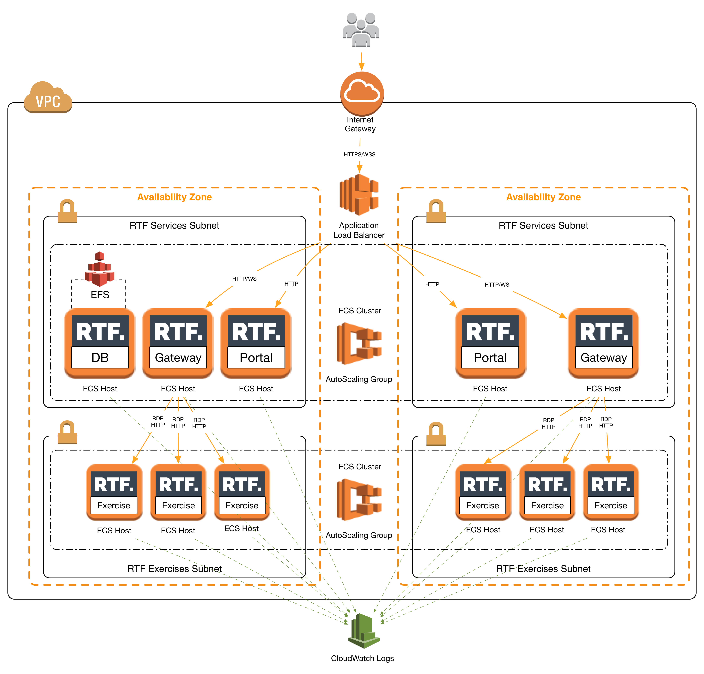
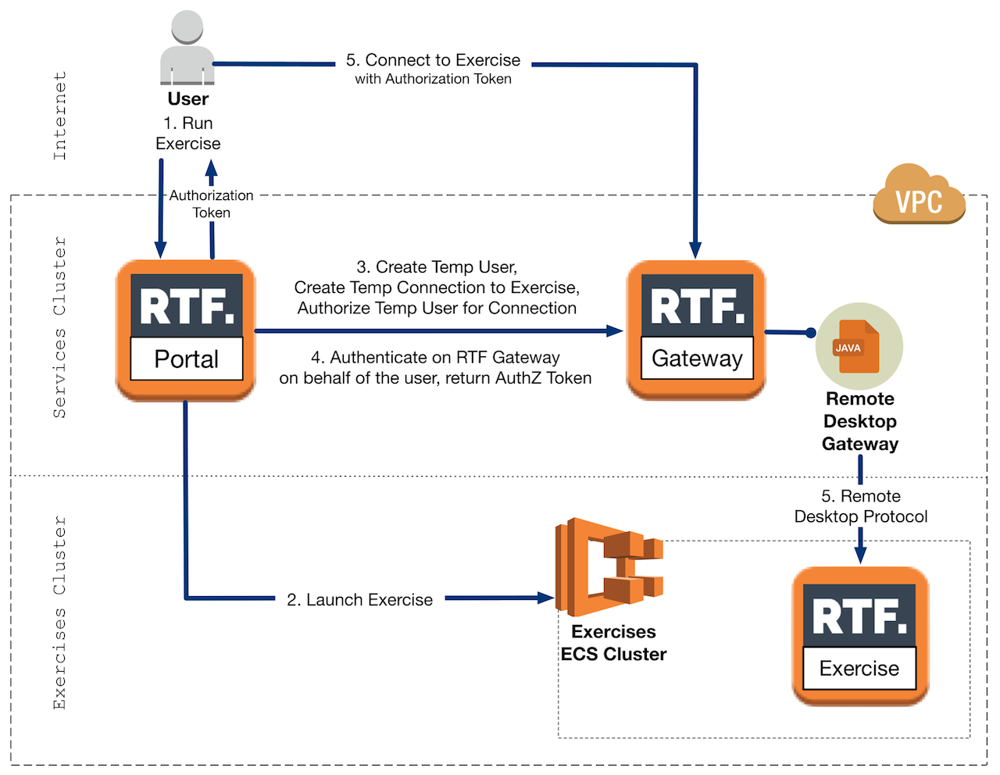

### Architecture

RTF is based on a micro-services architecture which can be automatically deployed on AWS through CloudFormation.

  - **RTF VPC & Security Groups:** 
    Made up of 2 RTF Services subnets + 2 RTF Exercise subnets spread across two [availability zones](https://docs.aws.amazon.com/AWSEC2/latest/UserGuide/using-regions-availability-zones.html#concepts-regions-availability-zones). 

    Traffic from the Internet is routed through an [Application Load Balancer](https://docs.aws.amazon.com/elasticloadbalancing/latest/application/introduction.html) (ALB) which exposes TCP ports 80 and 443. 

    EC2 instances deployed in the RTF Services subnet allow traffic in on ports 32768/TCP to 60999/TCP (Docker container ports) exclusively from the ALB and port 2049/TCP (AWS EFS) from within the RTF Services subnet. 

    EC2 instances deployed in the RTF Exercise subnet allow traffic in on ports 32768/TCP to 60999/TCP (Docker container ports) exclusively from the RTF Services subnet.

  - **RTF Services (ECS Cluster)**
    Deployed on the RTF Services subnet, runs the RTF Platform services: RTF Portal, RTF Gateway and RTF Database (Docker containers). 
    The *RTF Portal* provides the Web Application for users and managers to interact with the RTF Platform. User can browse exercises, challenges, compare their score with their peers on a Leaderboard and look at personal stats and achievements. Managers, depending on the assigned role, can manage all the aspects of the Platform from a dedicated web interface. 

    The *RTF Gateway* mediates the access from users to the Exercise's containers. When a valid authorization token is presented, the RTF Gateway creates an RDP connection to the Exercise's container and turns the RDP connection into an HTML5 stream which is rendered by the user's browser. The RTF Gateway also exposes a Gateway Agent which is invoked by the RTF Portal to retrieve results/logs/code diff from the RTF Exercises.

    The *RTF Database* holds the data for RTF Platform to run, both the RTF Portal and RTF Gateway use the RTF Database. However the RTF Gateway's database and its data can be considered transient. To ensure survival of data when a container fails and to support flexibility in the Tasks deployment strategy, the DBMS's data directory is mounted from an [Amazon EFS](https://docs.aws.amazon.com/AmazonECS/latest/developerguide/using_efs.html) file system. In this way, the RTF Database Task has access to the same persistent storage, no matter the instance on which it lands. 
    To allow easy service discovery of the RTF Database from the RTF Portal and RTF Gateway, the connection uses an [ambassador container](https://github.com/awslabs/ecs-task-kite).
    It is possible to deploy additional RTF Exercise Clusters and corresponding RTF Gateways (and one *ephemeral* RTF Database) in any AWS Region that supports Amazon ECS, reference the [Installation](install.md) section of the documentation. 

    The RTF Portal, RTF Gateway and RTF Database are deployed as [ECS Services](https://docs.aws.amazon.com/AmazonECS/latest/developerguide/ecs_services.html), this allows to run and maintain a specified number of instances of a task definition simultaneously in an Amazon ECS cluster. If any of the tasks fails for any reason, the ECS service scheduler launches another instance of the task definition to replace it and maintain the desired count of tasks in the service. The number of containers deployed for the RTF Portal and RTF Gateway scales in/out [automatically](https://docs.aws.amazon.com/AmazonECS/latest/developerguide/service-auto-scaling.html) based on Memory Utilization of the containers. Note only one Task instance of RTF Database can be run at the time. The EC2 instances on which the ECS Services Cluster runs are scaled in/out in number depending on the Memory Reservation of the ECS Cluster.

    Traffic from Users is routed to the RTF Portal and RTF Gateway through a load balancer. The load balancer distributes traffic across the number of tasks that are associated with the service and uses sticky sessions.

  - **RTF Exercises (ECS Cluster)**
    Deployed on the RTF Exercises subnet, runs the RTF Exercises (Docker containers). When an exercise is selected to run, the TaskDefinition associated with that exercise is run as an ECS Task. The time necessary to launch an exercise is dependant on whether the exercise image is already present on the EC2 instance(s) of the RTF Exercise cluster or needs to be retrieved from AWS ECR. Currently exercises images are cached for 168 hours (one week) before being cancelled from the EC2 instance. For caching purposes, it's also recommended to use a small number of large EC2 instances compared to a large number of small instances. Traffic in is only allowed through the RTF Gateway which mediates the access to the Docker container running the exercise for both the RDP connection (3389/TCP for user remote desktop access) and to the RTF Agent running in each exercise (Port 8080, for RTF Agent access from RTF Gateway)
    Exercises runs in Docker containers with no outbound connectivity and no capability of clipboard/file sharing through RDP.
    The EC2 instances on which the ECS Exercises Cluster runs are scaled out (scale in coming soon, see TODO) number depending on the Memory Reservation of the ECS Cluster.

  - Centralised Logs on AWS CloudWatch
    All the RTF Services and RTF Exercises push logs to Amazon CloudWatch. CloudWatch allows to track metrics, collect and monitor log files. RTF registers two alarms: Memory Utilization for Containers used to trigger ECS Service Autoscaling and Memory Reservation for EC2 Instances used to trigger EC2 Autoscaling.

**Exercise Flow**

When a User select an Exercise to run, the RTF Portal launches a Container (Task) in the Excercise ECS Cluster based on the TaskDefinition for the selected exercise (previously registered on the platform, see [Configuration](configure.md)). The RTF Portal then issues a request to the RTF Gateway to create a temporary user and a temporary connection for this temporary user to the newly created exercise Task (Docker container). The RTF Portal then issues another request to the RTF Gateway, authenticating on behalf of the temporary user (server-to-server) and returning an authorisation token to the user. The user's browser connects to the RTF Gateway using the authorisation token, the RTF Gateway mediates the access to RTF Exercise running in the Exercise ECS Cluster through an RDP connection.

**Results Flow**

When requesting the real-time status of the remediation of a vulnerability or to collect logs and code diff, the RTF Portal issues a request to the RTF Gateway of the Exercises Cluster where the exercise is running. The RTF Gateway then issues a request to the RTF Agent running in the container of the RTF Exercise. The Agent performs the action requested and returns the results to the RTF Gateway which forwards them to the RTF Portal.

  