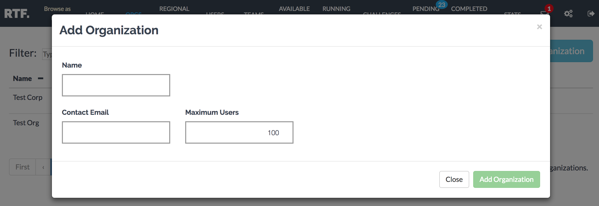
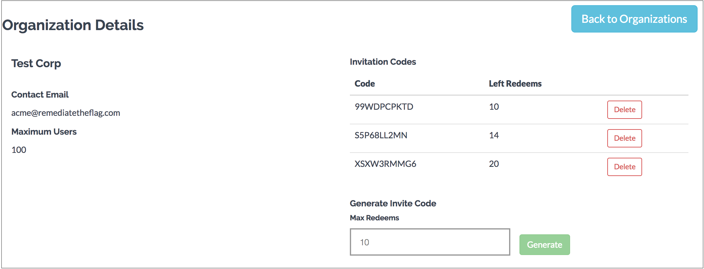
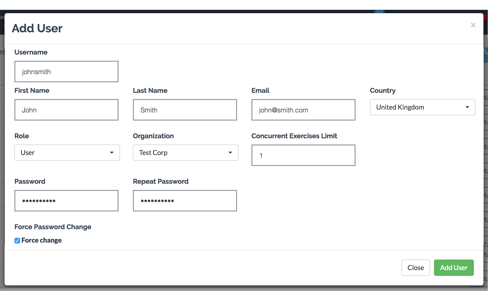
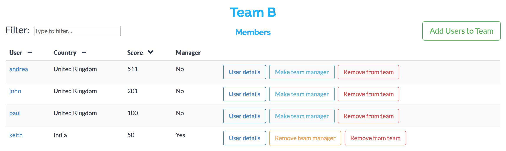
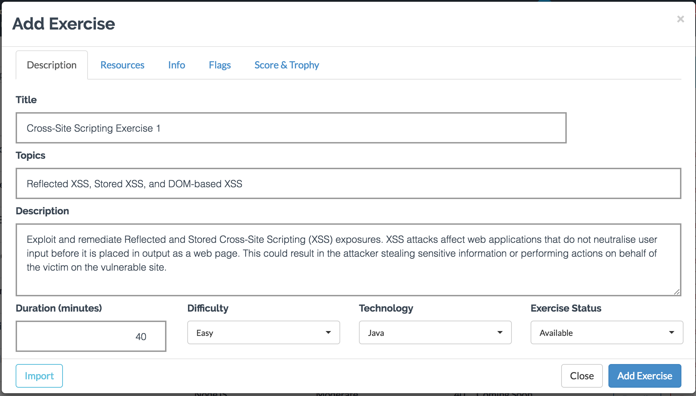
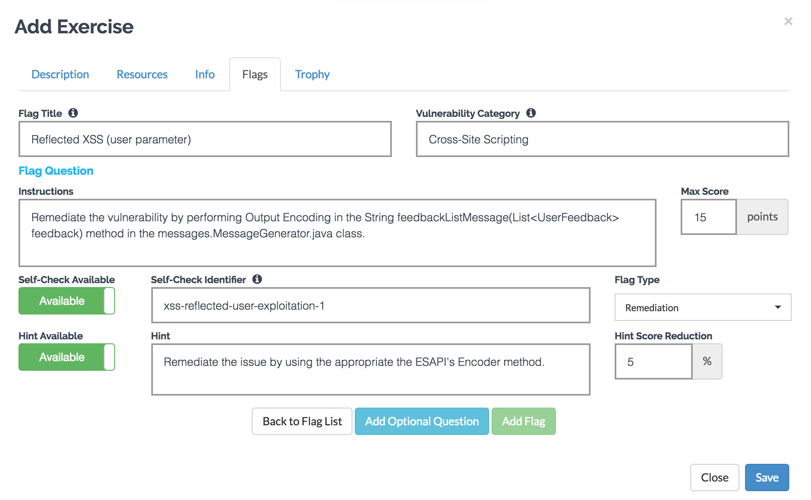
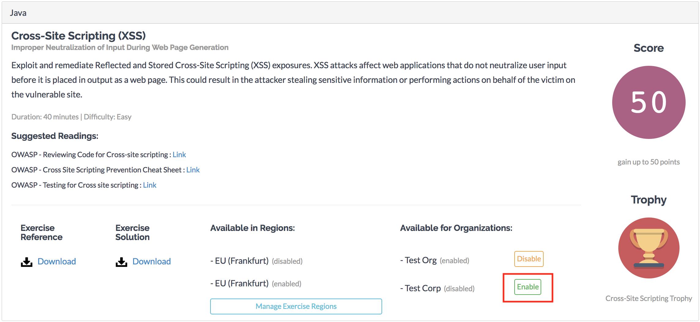
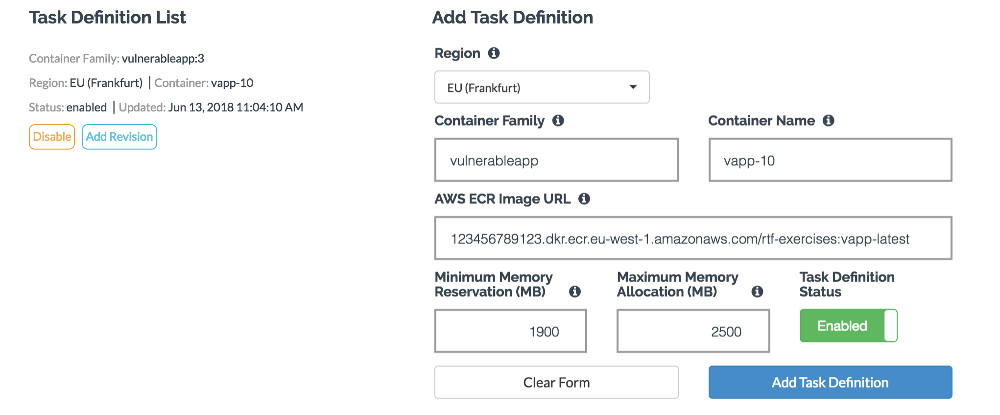

### Platform Configuration ###

The platform comes installed with an admin user (its password is set on the RTF Master Template in CloudFormation), a sample organization and a team. Setup the platform by creating organizations, teams and users to mirror your internal structure. It is also possible to invite users to signup to a specific organization by generating invitation codes that users can redeem. 


1. **Create Organizations**

    Organizations model a company or a division within a company. Users can be part of one organisation, management users can manage multiple organisations.

    

    

    Through the management interface, admins can generate codes to invite users to join the platform.

    

    

2. **Add Users**

   Add users to a specific Organization, specify user role and how many exercises the user can run concurrently.
   
   Available Roles:

    - RTF Admin: 
      
      Access/Updated/Modify/Delete Exercises and RTF Gateways
    - Admin:
      
      Access/Create/Update/Remove Organizations, Teams, Users, Challenges; Access data 
    - Reviewer:
      
      Review Exercises, Create/Update Users and Teams, Manage Teams and Challenges, Access data 
    - Team Manager:
      
      Review Exercises for managed teams, Setup Challenges for managed teams, Access data for managed teams
    - Stats Monitor:
      
      Access Metrics, Access User, Teams, Challenges data
    - User:
      
      Run exercises, join Challenges, view completed exercises, personal/team stats and achievements.

3. **Create Teams**

    Through the management interface create Teams and Users to them. Teams as Users belong to one organizations. Currently a User can be added to only one Team. Team Managers can review exercises completed by members of their teams. Team Managers can also add/remove users to their Teams.

       

    

4. **Onboard Regional Gateways**

    The RTF Gateway mediates the access to an RTF Exercise running in an ECS cluster. Onboard the RTF Gateway created during deployment and any additional regional gateways you deployed using the Regional Gateway [template](https://s3-eu-west-1.amazonaws.com/rtf-public-templates/rtf-template-regional-gateway.yaml). To onboard the Gateway just specify a name, the AWS Region where the Gateway and ECS Cluster are deployed and the FQDN for the regional gateways. Users will connect to the regional gateway while performing the exercise. To keep latency down it is advised to deploy regional clusters/gateways in regions geographically close to the platform users.

    

5. **Add Exercises**

    Add the *metadata* for the exercise including title, description, category, score, trophy, etc. Provide a reference file for the exercise describing further instructions for the candidates and a solutions file. The exercise data can also be imported/exported for easier onboarding. Check demo [exercises](https://github.com/sk4ddy/remediatetheflag/tree/master/RTF-ExerciseMetadata) that can be imported.

    

    

    Add 'Flags' in scope for the exercise. Each Flag (e.g. Reflected XSS - User Parameter) has an exploitation and a remediation part. Provide the instructions on how to exploit and how to remediate the Flag. You can also provide a hint (visible to reviewer, affects final score) and the name of the test performed by the automated checker (see later in the documentation).

    

    

6. **Enable Exercises for Organizations**

    Once added, an exercise needs to be enabled for each organization. Admin users can enable/disable exercises for managed organizations.

    

    

7. **Register Exercises on Regional Clusters**

    To run an exercise, you need to have the corresponding RTF Exercise docker image on your AWS ECR repository. You need to register the exercise on each regional cluster where you want to make it available. Behind the scenes, the RTF Platform creates a TaskDefinition  to run the exercise's image in the specified AWS Region. Data transferred between Amazon Elastic Container Registry (ECR) and Amazon EC2 within a single region is free of charge, so to lower costs keep an image of the exercise in an ECR repository of each region where you deployed an RTF Gateway.

    

    

    The instructions below walk you through using the VulnerableApp Java exercise pack with a number of exercises.

    a. **Configure AWS CLI**
        Install and configure AWS CLI to push and manage Docker Images on AWS Elastic Container Registry. Reference the AWS [tutorial](https://docs.aws.amazon.com/cli/latest/userguide/cli-chap-getting-started.html) for instructions.

    b. **Pull Exercise Docker image from DockerHub**

    - RTF VApp Java Exercise Pack

      Pack of exercises that focus on exploitation/remediation written in Java.

      ```
      docker pull remediatetheflag/exercise-vulnerableappjava:1.0
      ```

    c. **CLI Login to AWS ECR**

    - Retrieve the login command to use to authenticate your Docker client to your registry.

      ```
      aws ecr get-login --no-include-email
      ```

    - Run the login command from the output of the previous command.

    d. **Create a Repository on AWS ECR**

    Create repositories on AWS ECR to host the images for the RTF-Services and RTF-Exercises, reference the [tutorial](https://docs.aws.amazon.com/AmazonECR/latest/userguide/ECR_GetStarted.html). I recommend creating at least one repo for services and one for exercises. Additionally, take into account that data transferred between Amazon Elastic Container Registry (ECR) and Amazon EC2 within a single region is free of charge, if you're deploying exercise clusters only in one region, create the ECR repository in the same region to keep costs down and increase speed when transferring images from ECR to EC2 instances for execution on ECS.
    If you deployed RTF Gateways in multiple regions, you could create an ECR repository in each of those regions and push the exercise image in each ECR repository. Following this approach you won't be charged for cross-region data transfer from ECR to the ECS cluster (intra region data transfer is free).

    - Create a repository (e.g remediatetheflag/exercises)
      ```
      aws ecr create-repository --repository-name remediatetheflag/exercises --region us-east-2
      ```
      ###### Note address of ECR Repository 

      ###### (e.g 1234567891234.dkr.ecr.us-east-2.amazonaws.com/remediatetheflag/exercises)

    e. **Push Docker images to ECR Repository**

    - Tag your image so you can push the image to this repository:

      ```
      docker tag remediatetheflag/rtf-exercises:latest 1234567891234.dkr.ecr.us-east-2.amazonaws.com/remediatetheflag/exercises:vulnerableappjava-1.0
      ```

    - Run the following command to push this image to your newly created AWS repository:

      ```
      docker push 1234567891234.dkr.ecr.us-east-2.amazonaws.com/remediatetheflag/exercises:vulnerableappjava-1.0
      ```


