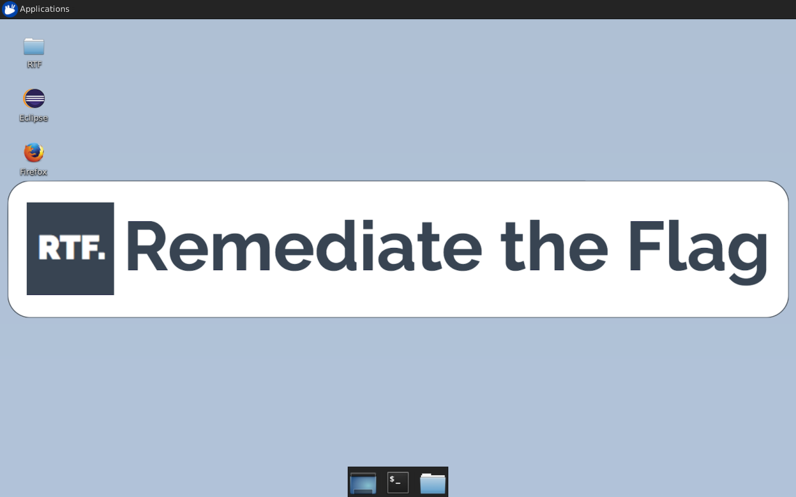

### Create New Exercise

1. **Add Dependencies and Exercise files to Base Exercise Image**

    To create a new exercise, you can follow three different approaches:
    - add a new exercise to an existing vulnerable application integrated on RTF

      * Vulnerable App / Java EE
        Download the source for the [existing exercise](https://bitbucket.org/remediatetheflag/rtf-docker-templates/src/3fdf01d7d4b2aec5bc4fe97cf464315417abf356/RTF-Docker-VApp/?at=master) (Dockerfile + filesystem), integrate your changes (e.g. add new classes, web page, etc) and build a new image.
      * VulnerableChat / NodeJS

    - integrate a new vulnerable application for an already supported technology stack

      Download the source for the RTF Exercise Base Image that matches the technology stack of your exercise (e.g. Java, NodeJS, Ruby, etc). The Base Image provides an Ubuntu Desktop with RTF Gateway support and the RTF Agent. The Base Image also provides IDE, Application Server and DBMS that matches the selected technology stack (e.g. Java/Apache Tomcat/MySQL, NodeJS/Redis/Mongo).

      The following technology stacks are available for download:

      * [Java / Apache Tomcat / MySQL / Eclipse](https://bitbucket.org/remediatetheflag/rtf-docker-templates/src/3fdf01d7d4b2aec5bc4fe97cf464315417abf356?at=master)
      * NodeJS / Redis / Mongo / Atom
      * Ruby on Rails / MySQL / Atom 

    - integrate a new vulnerable application for a non-yet supported technology

      Download the [RTF Exercise Base Image](https://bitbucket.org/remediatetheflag/rtf-docker-templates/src/3fdf01d7d4b2aec5bc4fe97cf464315417abf356/RTF-Docker-Base-Exercise/?at=master) which provides an Ubuntu Desktop with RTF Gateway support and the RTF Agent

2. **Build image**

    * After adding additional dependencies and exercise's files, build the docker image.

        ```
      cd /path/to/docker/image
      docker build . -t newRTFExercise:latest
        ```

3. **Run container**

    - Run a container for the newly created image.

        ```
        docker run -P -e USR_PWD=REPLACE_WITH_USR_PASSWORD --privileged -i newRTFExercise:latest
        ```

    - List running container and note the host port for the container port 3389/TCP.

        ```
        docker container ls
        ```

        

        

    - Connect to the container using an RDP Client. Specify the connection settings to match the host port for the RDP port 3389 on the container and the password selected when running the exercise.

      

      

      You will be connected to an Ubuntu Desktop:      

      

      

4. **Integrate exercise and customize look & feel**.

    After having installed the additional dependencies and copied the files of the exercise, you will need to integrate the vulnerable application in the IDE and update the instructions file to point to the home page of the vulnerable application. <u>The steps that follow are an **example** for integrating a Java EE Vulnerable App in Eclipse IDE and modify the instructions file.</u>

    - In Eclipse IDE:

      * File → New → Other

      * Select "Dynamic Web project" in the wizard screen, click on "Next"

      * Uncheck "Use default location" and specify path to Java Vulnerable App's project folder.

        

        

      * Click on "Next", "Next", and "Finish"

      * In Project Explorer, right click on the newly created Java Web Project, select "Build Path", and "Configure Build Path".

      * Click on "Add Jar" and include all the JARs required by the application. Then click on "Ok", and "Apply and Close".

        

        

      * In the Servers tab, double click on Tomcat. Select on which port to start Tomcat on, note 8080/TCP and 3389/TCP are already reserved. I recommend using 8050/TCP. 

        

        

      * Browse to "Modules" tab. Click on "Add", select "VApp" and set the Path to "/". (Bug with Eclipse: sometimes you need to edit the configuration after creation because the path is not always set.)

        

        

      * Start the server and ensure everything works as expected.

        

        

    - Instructions File

      Edit the file /home/rtf/instructions/instructions.html to point to the home page of the vulnerable application.

      ```html
      <div id="service">
      ...
       <ol>
         <li>Start the Java Vulnerable Application in Eclipse IDE</li>
         <li>Browse to <a href="http://www.vulnerableapp.com:8050/">Vulnerable App</a>   </li>
         <li>Reference the 'General Information' and 'Exercise Flags' tabs on the RTF portal.</li>
       </ol>
      </div>
      ```

5. **Export user's home folder and add it to Image's filesystem.**

    - When integrating and customising the Exercise instance, all the changes are saved within the home folder of the ```rtf``` user. it is possible to simply export the user's home and replace it on the filesystem of the new image.

      ```
    docker container ls
    docker cp [containerId]:/home/rtf /tmp/rtf_home
    rm /tmp/rtf_home/.xorgxrdp*
    rm /tmp/rtf_home/.xsession-errors
    rm -rf /path/to/docker/image/fs/rtf
    cp /tmp/rtf_home path/to/docker/image/fs/rtf
    cd path/to/docker/image/ 
    zip -r base.zip fs/ run/
      ```

6. **Re-build image**
    - Build the image again with the updated filesystem.
        ```
        cd /path/to/docker/image
        docker build . -t newRTFExercise:latest
        ```
    - Test the image and repeat steps 4-6 until you're satisfied.

7. **Push image to AWS ECR**
    - Tag your image so you can push the image to this repository:

      ```
      docker tag newRTFExercise:latest 1234567891234.dkr.ecr.us-east-2.amazonaws.com/remediatetheflag/exercise:newRTFExercise-latest
      ```

    - Run the following command to push this image to your newly created AWS repository:

      ```
      docker push 1234567891234.dkr.ecr.us-east-2.amazonaws.com/remediatetheflag/exercise:newRTFExercise-latest
      ```


### RTF Agent & Automated Checker

  When requesting the real-time status of the remediation of a vulnerability or to collect logs and code diff, the RTF Portal issues a request to the RTF Gateway where the exercise is running to check the results or collect the artefacts. The RTF Gateway then issues a request to the RTF Agent running in the container of the RTF Exercise.

  


  The RTF Agent runs in each Exercise instance, it receives requests from the RTF Gateway and  provides the following functionalities:

  - Exercise Logs retrieval: collects logs from the exercise instance, these are made available to the assessor when reviewing exercises and can also be used for performance analysis and troubleshooting purposes. 
  - Source Code Diff: performs a diff between the original code of the exercise and the code edited by the candidate. This is made available to the assessor when reviewing the exercises.
  - Automated Checker: runs tests included with the vulnerable exercise and returns a result on whether the issues have been remediated or not. 


  The RTF Agent is configured through a JSON file:

  ```json
{
  "version": "0.1",
  // location of log files     
  "logFiles": [
      "/home/rtf/Desktop/RTF/rtf.log", // logs from vulnerable exercise
      "/var/lib/tomcat8/rtf-exercise-agent.log", // logs from rtf agent
      "/var/lib/tomcat8/logs/catalina.out" // logs from tomcat running the rtf agent
  ],
  // location of source files for code diff
  "originalSourceDirectory": "/home/rtf/Desktop/RTF/Reset/", // original code
  "exerciseSourceDirectory": "/home/rtf/Desktop/RTF/VApp/", // candidate modified code
  // OS commands to be executed by the automated checker 
  "testCommand": "java -jar /home/rtf/vappTests.jar checkFinal", // do all checks
  "testCommandLite": "java -jar /home/rtf/vappTests.jar checkRealtime", //do fast checks
}
  ```


  The RTF Agent can be configured to invoke two different OS commands for the Automated Checker to return a result:  

  - ```testCommand``` represents the OS command that the RTF Agent executes to run all the tests defined by the exercise; this is used at the end of an exercise to perform exhaustive tests. 
  - ```testCommandLite``` represents the OS command that the RTF Agent executes to perform lightweight tests that take less time, this is used when performing a real time check of the status of the vulnerability during an exercise.

The tester program to be run for the automated checker functionality can be written in any technology and run as a shell command by the RTF Agent. The test program should return a JSON message describing the vulnerability status of each issue in scope for the exercise in the format  ```{"name_of_test":is_vulnerable }```

  ```json
{
  "results": [
    { "xss-reflected-1": true },
    { "xss-reflected-2": false },
    { "xss-stored-1": true }
  ]
}
  ```

The tester program can employ a number of different strategies to check whether an issue has been remediated or not. <u>D</u><u>epending on the type of vulnerability, a strategy may be easier to implement than another one.</u>

  * Blackbox Tests

    - End-to-End HTTP requests/responses

      You can employ programmatic HTTP requests to the vulnerable application and check a condition on the response (e.g. the presence of a string in a specific encoding).    

      *Example of testing for Reflected XSS using a Java program:*

      ```java
      public Boolean xssTest(String cookie) {
        return sendGet(host, "/logged/home.jsp?user=%3C/test()%3E","</test()>", cookie);
      }
      ```

     - UI Automation scripts

       UI testing is a powerful and reliable technique to imitate user activity, it maybe used to test vulnerabilities by checking the expected result of the issue as a side effect in the browser.

       *Example of testing for DOM Based XSS* using Mocha, Chai and Nightmare.js:

       ```javascript
       const Nightmare = require('nightmare')
       const chai = require('chai')
       const expect = chai.expect
       describe('test xss dom based', () => {
        it('should display pwned in the error div', function(done) {
         const nightmare = Nightmare()
         nightmare
        	.goto(host)
        	.type('#username', username)
        	.type('#password', password)
        	.click('#loginButton')
        	.wait(2000)
        	.goto(host+"/#lang=document.getElementById('error').innerHTML='pwned'")
        	.evaluate(() => document.querySelector('#error').innerHTML)
        	.end()
        	.then(string => {
          		expect(string).to.equal('pwned')
          		done()
        	})
         })
       })
       ```


  * Whitebox Tests
    - Unit Tests 

      Unit tests can be used to exercise methods of the code. This is a useful strategy for secure coding exercises (e.g. implement secure encryption)

    - Static Analysis (late 2018)

      The RTF agent will be augmented with the capability to perform, at the end of the exercise, a static analysis scan of the vulnerable application to detect remediation of vulnerabilities.

