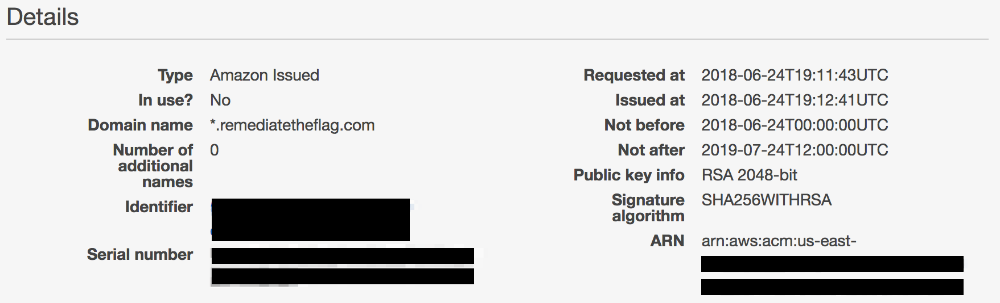
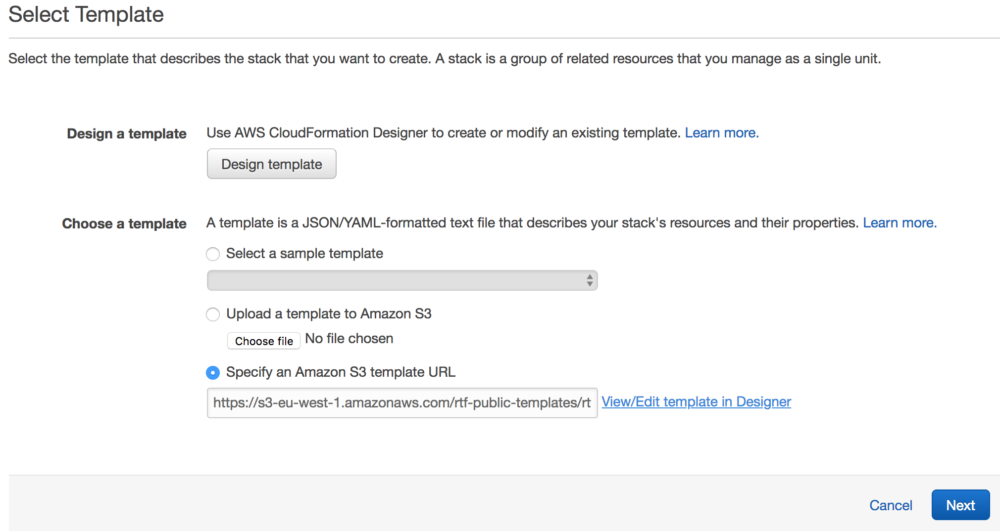
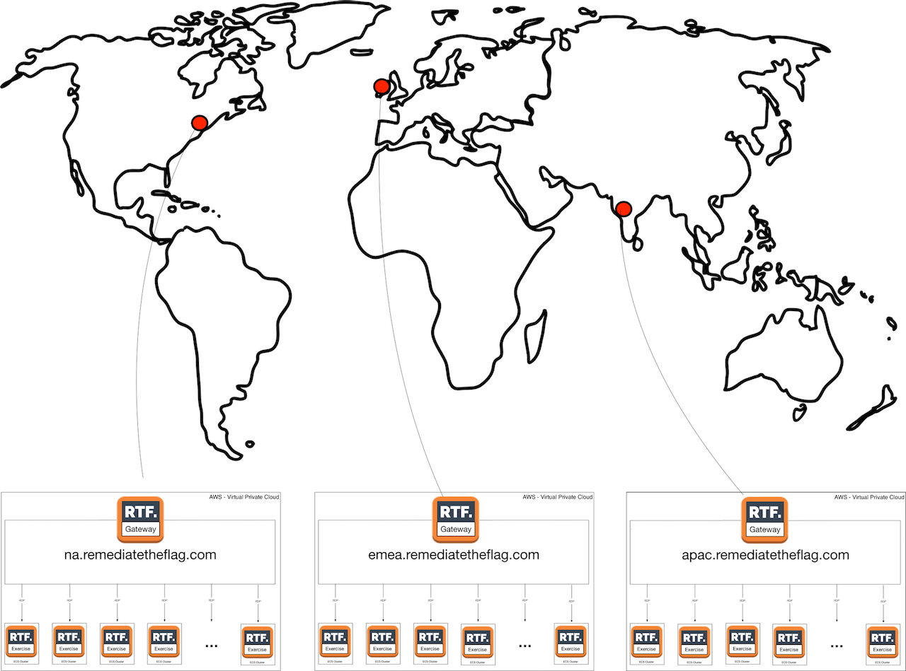

### Platform Installation

1. **Create AWS Account**
    If you already have an AWS account, skip this step. Reference the [tutorial](https://aws.amazon.com/premiumsupport/knowledge-center/create-and-activate-aws-account/).

2. **(Optional) Register a New Domain** 
    To run RTF you will need to have a domain, the ability to create subdomains and manage DNS records.  If you already have a domain name, skip this step. AWS Route 53 provides this [service](https://docs.aws.amazon.com/Route53/latest/DeveloperGuide/domain-register.html) as well.

3. **Get SSL/TLS Certificate for Domain**
    You can request a publicly trusted certificate issued by AWS Certificate Manager or import an existing certificate. Reference the [tutorial](https://docs.aws.amazon.com/acm/latest/userguide/gs-acm-request-public.html).

    

    ###### Save the ARN for the generated/imported certificate

4. **(Optional) Create Key Pair**
    If you require SSH access to the EC2 instances created as part of the RTF deployment, generate a Key Pair. Reference the [tutorial](https://docs.aws.amazon.com/AWSEC2/latest/UserGuide/ec2-key-pairs.html#having-ec2-create-your-key-pair).

5. **Create IAM User for Programmatic Access** *(soon automated in CloudFormation)*
    The RTF-Portal service requires programmatic access to AWS in order to start/stop Tasks (Docker containers) for RTF Exercises, manage TaskDefinition and access ECS cluster metrics. Reference the [tutorial](https://docs.aws.amazon.com/IAM/latest/UserGuide/id_users_create.html#id_users_create_console).

    - Create a User for Programmatic Access

    - Set Permissions, select "Attach existing policies directly"
      * AmazonECS_FullAccess *(TODO: this can be reduced)*
      * AmazonEC2ContainerRegistryReadOnly
      * CloudWatchReadOnlyAccess

    ###### Save the Access Key Id and Secret Access Key

6. **Configure AWS CLI**
    Install and configure AWS CLI to push and manage Docker Images on AWS Elastic Container Registry. Reference the [tutorial](https://docs.aws.amazon.com/cli/latest/userguide/cli-chap-getting-started.html).

7. **Pull images from DockerHub**

    Pull Docker Images for RTF Services from DockerHub *(alternatively build them from source).*

    * RTF Database Service

      Database service that hosts data for the RTF Platform. RTF-Portal and RTF-Gateway services connect to this service through the RTF Kite container.

      ```
      docker pull remediatetheflag/rtf-database
      ```

    * RTF Gateway Service

      Allows user to connect to the remote desktop for RTF Exercises.

      ```
      docker pull remediatetheflag/rtf-gateway
      ```

    * RTF Portal Service

      Web Application to run and manage the RTF Platform.

      ```
      docker pull remediatetheflag/rtf-portal
      ```

    - RTF Kite 

      A simple ambassador container for inter-task communication on ECS following the [Ambassador Pattern](https://docs.docker.com/v17.09/engine/admin/ambassador_pattern_linking/).

      ```
      docker pull remediatetheflag/rtf-kite
      ```

    - RTF VApp Java Exercise Pack

      Pack of exercises that focus on exploitation/remediation written in Java.

      ```
      docker pull remediatetheflag/exercise-vulnerableappjava
      ```

8. **CLI Login to AWS ECR**

    - Retrieve the login command to use to authenticate your Docker client to your registry.

      ```
      aws ecr get-login --no-include-email
      ```

    - Run the login command from the output of the previous command.

9. **Create a Repository on AWS ECR**

    Create repositories on AWS ECR to host the images for the RTF-Services and RTF-Exercises, reference the [tutorial](https://docs.aws.amazon.com/AmazonECR/latest/userguide/ECR_GetStarted.html). I recommend creating at least one repo for services and one for exercises. Additionally, take into account that data transferred between Amazon Elastic Container Registry (ECR) and Amazon EC2 within a single region is free of charge, if you're deploying exercise clusters only in one region, create the ECR repository in the same region to keep costs down and increase speed when transferring images from ECR to EC2 instances for execution on ECS.

    - Create a repository (e.g remediatetheflag/services)
      ```
      aws ecr create-repository --repository-name remediatetheflag/services --region us-east-2
      ```
      ###### Note address of ECR Repository 

      ###### (e.g 1234567891234.dkr.ecr.us-east-2.amazonaws.com/remediatetheflag/services)

10. **Push Docker images to ECR Repository**

    - Tag your image so you can push the image to this repository:

      ```
      docker tag remediatetheflag/rtf-database:latest 1234567891234.dkr.ecr.us-east-2.amazonaws.com/remediatetheflag/services:rtf-db-latest
      ```

    - Run the following command to push this image to your newly created AWS repository:

      ```
      docker push 1234567891234.dkr.ecr.us-east-2.amazonaws.com/remediatetheflag/services:rtf-db-latest
      ```

11. **Import and tweak AWS CloudFormation template**
    On the AWS console, browse to CloudFormation. You will need to import, tweak and run the [RTF master template](https://s3-eu-west-1.amazonaws.com/rtf-public-templates/rtf-template.yaml). This will automatically create the RTF infrastructure and deploy all services. Reference the [tutorial](https://docs.aws.amazon.com/AWSCloudFormation/latest/UserGuide/cfn-using-console-create-stack-template.html).

       - Click on "Create New Stack"

       - Select "Specify an Amazon S3 Template Url" and enter the RTF public template:

         ```
         https://s3-eu-west-1.amazonaws.com/rtf-public-templates/rtf-template.yaml
         ```

         

       - Click on "View/Edit template in Designer"

       - Tweak the templated editing these items to match your configuration:

          ```yaml
          ALB:
           #Replace with AWS ACM TLS Certificate ARN (From Step 3)
           LoadBalancerCertificateArn: arn:aws:elasticloadbalancing:us-west-2:123456789012:certificate/50dc6c495c0c9188/f2f7dc8efc522ab2
          ServicesECS:
           #Choose EC2 Instance Type to run RTF-Services (https://aws.amazon.com/ec2/instance-types/)
           InstanceType: t2.medium
           #EC2 Autoscaling Min/Max Instances to launch in the RTF Services ECS Cluster
           MinClusterSize: 1
           MaxClusterSize: 4
          ExercisesECS:
            #Choose EC2 Instance Type to run RTF-Exercises, more memory = more concurrent RTF exercises (https://aws.amazon.com/ec2/instance-types/)
           InstanceType: m4.large
            #EC2 Autoscaling Min/Max Instances to launch in the RTF Exercises ECS Cluster, more memory = more concurrent RTF exercises
           MinClusterSize: 1
           MaxClusterSize: 4
          MysqlService:
           #Replace Passwords, match them in the other services in this template
           GuacRTFAdminUserPassword: REPLACE-GUAC-ADMIN-PASSWORD
           GlobalRTFAdminUserPassword: REPLACE-GLOBAL-ADMIN-PASSWORD
           MysqlGlobalUserPassword: REPLACE-MYSQL-GLOBAL-PASSWORD
           MysqlGuacUserPassword: REPLACE-MYSQL-GUAC-PASSWORD
           MysqlRootUserPassword: REPLACE-MYSQL-ROOT-PASSWORD
           #Replace with ECR address to Mysql Service Image (From step 10)
           MysqlImage: REPLACE-PATH-TO.ecr.eu-west-1.amazonaws.com/rtf-services:rtf-db-latest
          GlobalService:
           #ECS Service Autoscaling, Min/Max number of concurrent ECS tasks (Docker containers) for the RTF-Global (Portal) Service
           DesiredCount: 1
           MaxCount: 4
           #Replace AWS Key ID/Secret information (From step 5)
           AwsKeyID: REPLACE-AWS-KEY-ID
           AwsSecretKey: REPLACE-AWS-SECRET-KEY
           #Replace Passwords, match them in the other services in this template
           GuacRTFAdminUserPassword: REPLACE-GUAC-ADMIN-PASSWORD
           MysqlGlobalUserPassword: REPLACE-MYSQL-GLOBAL-PASSWORD
           GatewayAgentPassword: REPLACE-GATEWAY-AGENT-PASSWORD
           #Choose hostname for RTF deployment (e.g remediatetheflag.net)
           GlobalHostname: REPLACE-PORTAL-FQDN
           #Replace with ECR address to Kite Service Image (From step 10)
           KiteImage: REPLACE-PATH-TO.ecr.eu-west-1.amazonaws.com/rtf-services:kite-latest
           #Replace with ECR address to Global Service Image (From step 10)
           GlobalImage: REPLACE-PATH-TO.ecr.eu-west-1.amazonaws.com/rtf-services:rtf-global-latest
          GatewayService:
           #ECS Service Autoscaling, Min/Max number of concurrent ECS tasks (Docker containers) for Gateway Service
           DesiredCount: 1
           MaxCount: 4
           #Choose hostname for the RTF Gateway deployment (e.g emea.remediatetheflag.net)
           GatewayHostname: REPLACE-GATEWAY-FQDN
           #Replace Passwords, match them in the other services in this template
           MysqlGuacUserPassword: REPLACE-MYSQL-GUAC-PASSWORD
           GatewayAgentPassword: REPLACE-GATEWAY-AGENT-PASSWORD
           #Replace with ECR address to Kite Service Image (Step 10)
           KiteImage: REPLACE-PATH-TO.ecr.eu-west-1.amazonaws.com/rtf-services:kite-latest
           #Replace with ECR address to Gateway Service Image (Step 10)
           GatewayImage: REPLACE-PATH-TO.ecr.eu-west-1.amazonaws.com/rtf-services:rtf-gateway-latest
          ```

12. **Run AWS CloudFormation template**

      - Click on "Create Stack", then click on "Next", 

      - Give a name to the stack (e.g. RTF-Deployment-US-East), click on "Next"

      - Scroll down and click on "Next"

      - Scroll down and check "I acknowledge that AWS CloudFormation might create IAM resources with custom names."

      - Click on "Create"

      - Wait ~ 11 minutes

      - When the stack is created, click on the root stack name (e.g. RTF-Deployment-US-East), click on "Outputs" and note the URL for the Application Load Balancer.

        

        

      - Modify the DNS records for your domain, adding a CNAME to the ALB Url. Add a CNAME for the RTF-PORTAL (e.g. www.remediatetheflag.com) and the RTF-GATEWAY (emea.remediatetheflag.com) pointing to the ALB url.


### Additional Regional Clusters / Gateways (Optional)

The RTF Gateway mediates the access to an RTF Exercise running in an ECS cluster. To increase concurrent exercise capacity, deploy additional Exercise Clusters / Regional Gateways in AWS regions geographically close to your user - this helps reduce the latency of the underlying RDP connection between RTF-Gateway and RTF-Exercise.

  

  

It's possible to deploy additional Regional Clusters/Gateways using the public CloudFormation [regional template](https://s3-eu-west-1.amazonaws.com/rtf-public-templates/rtf-template-regional-gateway.yaml). Tweak the configuration of the template referencing the instructions in the [Installation](install.md) section (steps 11-12). A valid domain and TLS certificate ARN are required before running the template.

- Run the CloudFormation template in a different region from the main RTF deployment, the template configures the following:
    - RTF ECS Exercise Cluster: runs RTF Exercises

    - RTF ECS Service Cluster 
      * RTF Gateway: mediates access to the RTF Exercises run in the ECS Exercise cluster.

      - RTF Database (ephemeral): provides database for RTF Gateway, data is temporary.

        - Application Load Balancer (ALB) to route the traffic to the RTF Gateway, exposes 80 and 443.
- After creation, <u>modify the DNS entry for the hostname of the new RTF Gateway with the Application Load Balancer URL</u>, reference the instructions in the [Installation](install.md) section (step 12) of the documentation.
- To enable the newly deployed RTF Exercise Cluster you need to <u>onboard the RTF Gateway in the management console of the RTF Portal</u>, reference the instructions in the [Configuration](configure.md) (step 4) section of the documentation .

